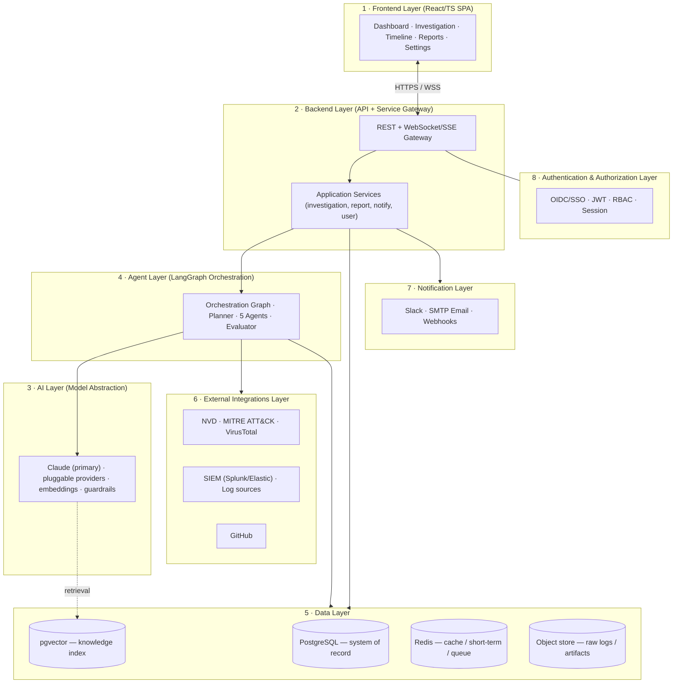
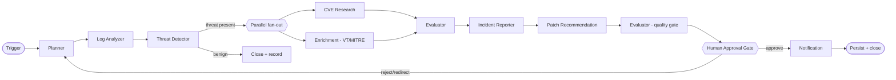
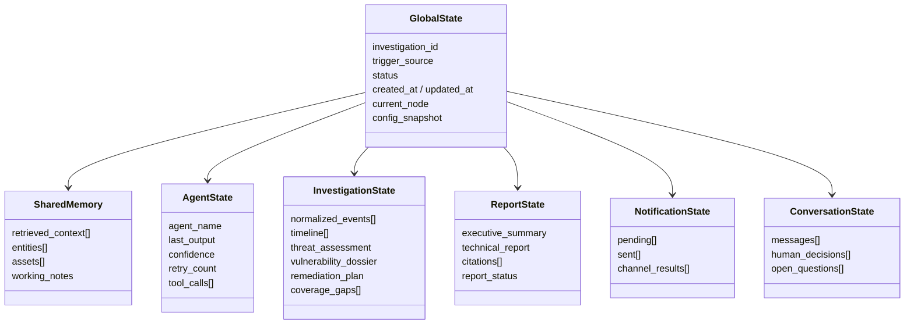
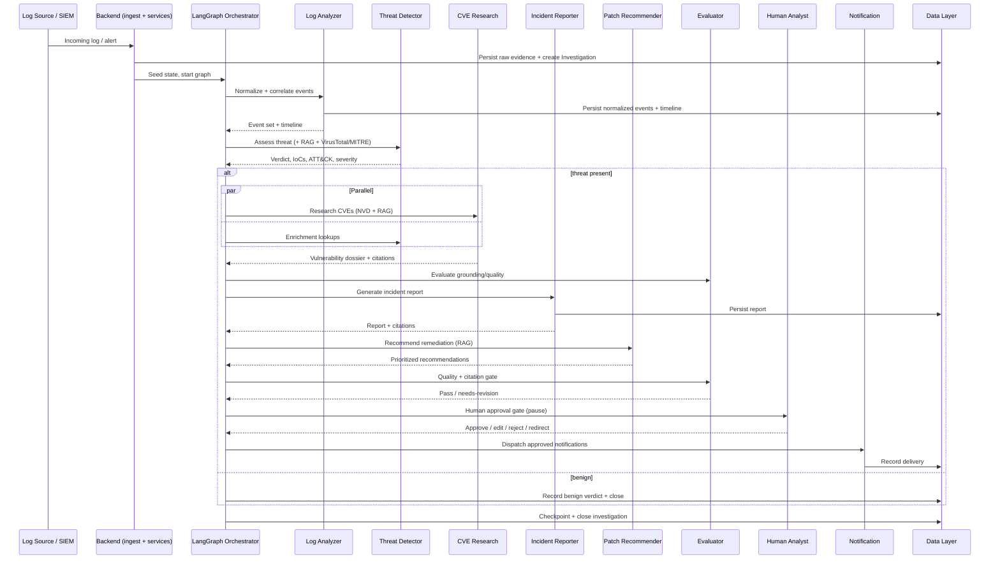
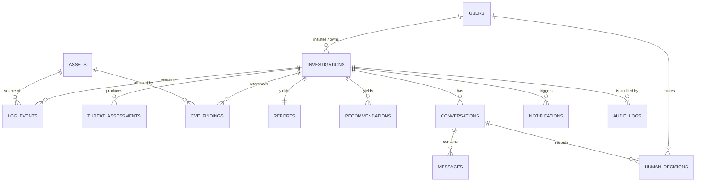
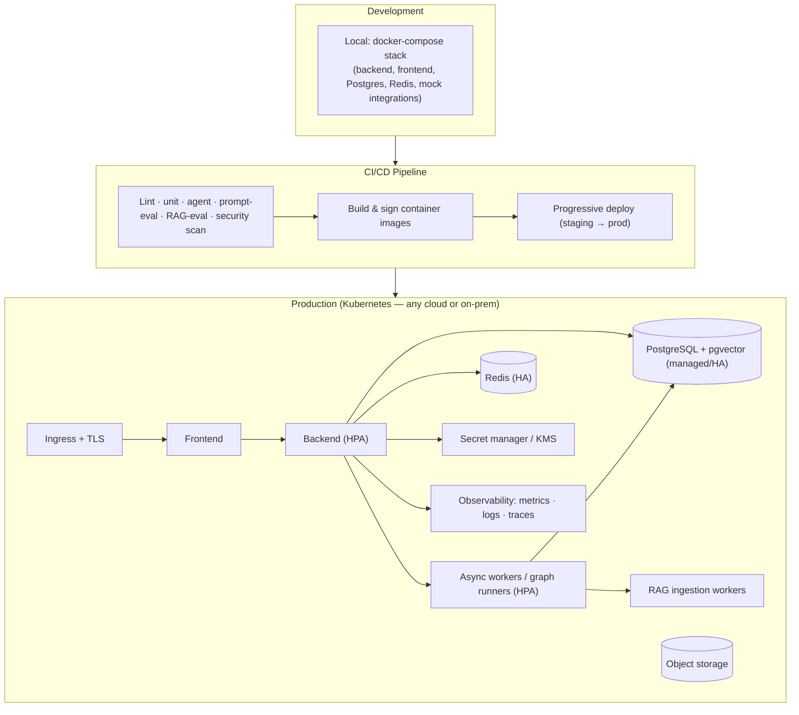

# AI Cybersecurity SOC Analyst — Technical Architecture Document (SAD)

| Field | Detail |
|---|---|
| **Document Title** | Software Architecture Document — AI Cybersecurity SOC Analyst |
| **Document Type** | Technical Blueprint (precedes implementation) |
| **Authored By** | Lead Architect (Principal Software Architect / Staff AI Engineer / Cybersecurity Architect) |
| **Audience** | Engineering team, security architects, SRE/platform, security leadership |
| **Date** | 24 July 2026 |
| **Status** | Baseline for engineering — approved for build planning |
| **Companion Document** | `PROJECT_CONTEXT.md` (defines *what* and *why*; this document defines *how*) |
| **Core Principle** | Human-in-the-loop. Agents investigate and recommend; humans decide and act. |

> **Reading guide.** This is an architecture and planning document. It contains **no implementation code, no pseudocode, no placeholder functions, and no API implementations** — API and database sections are *design/planning* only. Diagrams are structural (Mermaid). Every material decision is stated with its rationale and trade-off, in the format a Staff Engineer would expect when reviewing a production security platform.

### Confirmed Foundational Decisions

| Area | Decision | Rationale |
|---|---|---|
| **LLM strategy** | Anthropic Claude (latest models) as the primary reasoning engine, behind a **provider-agnostic model abstraction**. | Best-in-class reasoning for investigative work, while the abstraction avoids vendor lock-in and permits local/air-gapped models for regulated tenants. |
| **Orchestration** | **LangGraph** stateful multi-agent graph. | The workflow is a directed graph with conditional branches, retries, checkpoints, and human-interrupt gates — exactly LangGraph's model. Deterministic control flow around non-deterministic agents. |
| **Deployment** | **Cloud-agnostic** — Docker + Kubernetes, on-prem capable. | SOC data sovereignty varies by customer; a portable, containerized design deploys to any cloud or the customer's datacenter. |
| **Data stores** | PostgreSQL (system of record) + pgvector (RAG), Redis (cache/short-term/queue). | Mature, operationally well-understood, single relational engine reduces surface area; pluggable vector interface allows dedicated vector DBs at scale. |

---

## 1. Overall System Architecture

The platform is a **layered, service-oriented system** with a deterministic orchestration core wrapping non-deterministic AI agents. The architectural spine is a clean separation between *reasoning* (agents/LLM), *control* (the orchestration graph), and *systems of record* (data + audit). This separation is deliberate: AI components must be treated as fallible, replaceable, and independently testable, while the control and data layers must be strict, auditable, and trustworthy.

### 1.1 The Eight Layers



### 1.2 Layer Responsibilities & Communication

| # | Layer | Responsibility | Talks to | Protocol / Mechanism |
|---|---|---|---|---|
| 1 | **Frontend** | Analyst-facing SPA: dashboards, investigation workspace, human-approval UI, report viewing. Stateless client. | Backend | HTTPS (REST) for commands/queries; **WebSocket/SSE** for live investigation streaming. |
| 2 | **Backend** | API gateway + application services. Validates input, enforces authz, persists data, invokes orchestration, dispatches notifications. The *only* layer that writes to the system of record. | Frontend, Agent, Data, Notification, Auth | In-process service calls; async job queue for long-running investigations. |
| 3 | **AI Layer** | Model-provider abstraction: prompt assembly, model invocation, streaming, token/cost accounting, output validation, embeddings. Isolates the rest of the system from any specific LLM vendor. | Agent Layer (callers), Vector store (retrieval) | Internal SDK-style interface; outbound HTTPS to model provider(s). |
| 4 | **Agent Layer** | LangGraph orchestration: the Planner, the five specialized agents, the Evaluator, and the human-interrupt gates. Owns *reasoning workflow*, not data ownership. | AI Layer, External Integrations, Data (via services), Backend | LangGraph state transitions; tool calls to integrations. |
| 5 | **Data Layer** | Systems of record and derived stores: relational data, vector knowledge index, cache/short-term memory, object storage for raw logs and artifacts. | Backend, Agent | Connection pools; parameterized access via a data-access layer. |
| 6 | **External Integrations** | Adapters to third-party and enterprise data sources (threat intel, SIEM, SCM, log sources). Each is a bounded, individually-failing adapter. | Agent (as tools), Backend (ingestion) | Outbound HTTPS/API clients with circuit breakers, caching, rate limiting. |
| 7 | **Notification** | Outbound alerting to humans: Slack, email (SMTP), webhooks. Delivery guarantees, templating, deduplication. | Backend (dispatch), external services | Provider SDK/HTTPS; ret/queue-backed. |
| 8 | **Auth** | Identity, session, and access control across every request; cross-cutting. | Frontend, Backend (middleware) | OIDC/SSO federation, signed JWTs, RBAC policy checks. |

### 1.3 Key Architectural Decisions

- **Decision: Deterministic orchestrator around non-deterministic agents.** *Rationale:* Security operations require auditability and repeatability; LangGraph gives explicit, checkpointed control flow so that even when an agent's *output* varies, the *process* (which steps ran, what was retrieved, what a human approved) is deterministic and logged. *Trade-off:* more upfront modeling than a free-form agent loop.
- **Decision: Backend owns all writes; agents never write to the system of record directly.** *Rationale:* A single, validated, audited write path prevents an LLM-driven agent from corrupting state and keeps a clean security boundary. *Trade-off:* a small amount of indirection between agents and persistence.
- **Decision: Every external dependency is an isolated adapter with its own failure domain.** *Rationale:* NVD, VirusTotal, or a SIEM being down must degrade one capability, not halt an investigation. *Trade-off:* more adapter code and per-integration resilience logic.

---

## 2. Multi-Agent Architecture

Each agent is a **bounded specialist** with a single clear responsibility, a strict input/output contract, and its own failure handling. Agents do not call each other directly — the orchestration graph (§3) routes state between them. This keeps agents independently testable, replaceable, and reasoned-about.

> **Note on "Expected prompts / responses" below:** these describe the *intent and shape* of prompts and outputs at a design level. They are specifications, not implementation. Structured outputs are validated against schemas by the AI Layer before the graph advances.

### 2.1 Log Analyzer Agent

| Attribute | Specification |
|---|---|
| **Purpose** | Turn raw, heterogeneous log data into a normalized, deduplicated, correlated timeline of security-relevant events. |
| **Responsibilities** | Parse/normalize logs from multiple sources; extract salient events; filter noise; correlate related events across sources into a coherent sequence; flag anomalies for downstream triage. |
| **Inputs** | Raw or SIEM-queried log records (with source metadata), an investigation scope/time window, and prior correlation context from session memory. |
| **Outputs** | A structured **normalized event set** and a **preliminary timeline**, with per-event provenance (source, timestamp, host, actor) and a confidence/notability score. |
| **Memory requirements** | Short-term (current window of events), session memory (investigation-scoped correlation state), read access to knowledge memory (log-format/field mappings). |
| **Tools required** | Log source connectors (files, SIEM query, Windows Event Log, syslog), log parsers/normalizers, entity extractor, time-window correlator. |
| **Dependencies** | External Integrations (log sources/SIEM); AI Layer; Data Layer (to persist normalized events). Upstream in the graph. |
| **Failure handling** | Per-source partial failure is tolerated (proceed with available sources, record gaps); malformed records are quarantined, not dropped silently; on parser uncertainty, emit low-confidence event flagged for human/Evaluator review. |
| **Expected prompt (intent)** | "Given these log records and this time window, identify and normalize security-relevant events, correlate related activity across sources, and produce a provenance-tagged timeline. Do not infer threats; only structure and correlate evidence." |
| **Expected response (shape)** | Structured JSON: `events[]` (normalized, with provenance + notability), `timeline[]`, `correlations[]`, `coverage_gaps[]`, `confidence`. |

### 2.2 Threat Detector Agent

| Attribute | Specification |
|---|---|
| **Purpose** | Assess the normalized evidence to determine whether it represents a threat, identify indicators of compromise (IoCs), map to adversary techniques, and assign severity. |
| **Responsibilities** | Detect abnormal/anomalous behavior; extract and classify IoCs; map activity to MITRE ATT&CK techniques; determine attack severity; perform initial triage and prioritization. |
| **Inputs** | Normalized event set + timeline from Log Analyzer; retrieved detection knowledge (RAG); threat-intel enrichment (VirusTotal, MITRE). |
| **Outputs** | A **threat assessment**: verdict (benign/suspicious/malicious), IoC list, mapped ATT&CK techniques, severity + rationale, prioritized triage decision. |
| **Memory requirements** | Session memory (investigation state), knowledge memory (detection heuristics, ATT&CK mappings), short-term (current reasoning context). |
| **Tools required** | IoC extractor, VirusTotal lookup, MITRE ATT&CK mapper, severity scorer, RAG retriever over detection knowledge. |
| **Dependencies** | Log Analyzer (upstream); AI Layer; External Integrations (VirusTotal, MITRE); RAG. |
| **Failure handling** | If enrichment sources are unavailable, produce an assessment from available evidence with an explicit "enrichment degraded" flag and lowered confidence; never fabricate IoC reputation; escalate ambiguous high-impact cases to the human gate. |
| **Expected prompt (intent)** | "Given this correlated evidence and retrieved detection knowledge, determine whether this is a threat, extract IoCs, map to ATT&CK, and assign a severity with explicit reasoning and confidence. Distinguish evidence from inference." |
| **Expected response (shape)** | Structured JSON: `verdict`, `iocs[]`, `attack_techniques[]`, `severity{score,rationale}`, `triage_priority`, `enrichment_status`, `confidence`. |

### 2.3 CVE Research Agent

| Attribute | Specification |
|---|---|
| **Purpose** | Connect observed activity and affected assets to known, publicly documented vulnerabilities, and explain their meaning and severity. |
| **Responsibilities** | Search vulnerability databases; identify relevant CVEs; explain each vulnerability in clear terms; map observed behavior to known exploits; surface CVSS severity and exploitability context. |
| **Inputs** | Threat assessment + affected asset/software context; IoCs and ATT&CK techniques; retrieved CVE/exploit knowledge (RAG + live NVD). |
| **Outputs** | A **vulnerability dossier**: relevant CVEs with CVSS scores, plain-language explanations, exploit mappings, applicability assessment to the affected assets, and cited sources. |
| **Memory requirements** | Session memory, knowledge memory (CVE/MITRE corpus in the vector store), short-term reasoning context. |
| **Tools required** | NVD CVE API client, MITRE ATT&CK/CWE mapper, RAG retriever over vulnerability corpus, CVSS interpreter. |
| **Dependencies** | Threat Detector (upstream); RAG; External Integrations (NVD, MITRE); AI Layer. |
| **Failure handling** | On live-API failure, fall back to the cached/indexed CVE corpus and flag potential staleness; never assert a CVE applies without asset/version evidence — mark as "candidate" when uncertain; always attach citations. |
| **Expected prompt (intent)** | "Given the threat assessment and affected assets, retrieve and identify the relevant CVEs, explain them plainly, map them to the observed behavior, provide CVSS severity, and cite every source. Separate confirmed applicability from candidates." |
| **Expected response (shape)** | Structured JSON: `cves[]` (id, cvss, summary, applicability, exploit_mapping, citations[]), `candidates[]`, `source_freshness`, `confidence`. |

### 2.4 Incident Reporter Agent

| Attribute | Specification |
|---|---|
| **Purpose** | Synthesize the investigation into a clear, professional, defensible incident report for both technical and executive audiences. |
| **Responsibilities** | Assemble the investigation timeline; document findings; summarize affected assets; produce a technical narrative and an executive summary; preserve citations and provenance. |
| **Inputs** | Outputs of Log Analyzer, Threat Detector, and CVE Research; investigation metadata; report template/format. |
| **Outputs** | A structured **incident report**: executive summary, timeline, findings, affected assets, IoCs, mapped techniques, referenced CVEs, and confidence/caveats. |
| **Memory requirements** | Session memory (full investigation context), investigation history (for related-incident references), knowledge memory (report templates/standards). |
| **Tools required** | Report/timeline assembler, template renderer, summarizer, citation compiler. |
| **Dependencies** | All three upstream agents; AI Layer; Data Layer (persist report). |
| **Failure handling** | If an upstream section is missing/low-confidence, generate the report with explicit "incomplete/low-confidence" markers rather than omitting silently; never introduce findings not supported by upstream evidence (anti-hallucination check by Evaluator). |
| **Expected prompt (intent)** | "Given all investigation findings, produce a professional incident report with an executive summary and a technical section, an accurate timeline, affected assets, and citations. Include only claims supported by the provided evidence; mark any gaps." |
| **Expected response (shape)** | Structured document: `executive_summary`, `timeline[]`, `findings[]`, `affected_assets[]`, `iocs[]`, `techniques[]`, `cves[]`, `caveats[]`, `citations[]`. |

### 2.5 Patch Recommendation Agent

| Attribute | Specification |
|---|---|
| **Purpose** | Translate findings into prioritized, well-justified remediation guidance — for humans to review and execute. |
| **Responsibilities** | Recommend remediation steps; suggest patches; propose configuration hardening; prioritize by risk; explain the reasoning and importance of each recommendation. |
| **Inputs** | Vulnerability dossier + threat assessment + affected assets; retrieved remediation/runbook knowledge (RAG). |
| **Outputs** | A **prioritized remediation plan**: recommended actions, patches, config changes, each with risk-based priority, justification, and expected impact — explicitly framed as recommendations requiring human approval. |
| **Memory requirements** | Session memory, knowledge memory (remediation runbooks, vendor advisories), short-term reasoning context. |
| **Tools required** | RAG retriever over remediation knowledge, patch/advisory lookup (NVD/vendor, GitHub advisories), risk prioritizer. |
| **Dependencies** | CVE Research + Threat Detector (upstream); RAG; AI Layer. |
| **Failure handling** | Never recommend an automated destructive action; if remediation knowledge is thin, present conservative, general guidance flagged as such; always attach the rationale and the source; route all recommendations to the human approval gate. |
| **Expected prompt (intent)** | "Given the vulnerabilities, threat, and affected assets, recommend prioritized remediation (patches, configuration, mitigations), justify each with risk reasoning, and cite sources. These are recommendations for human approval — never assume execution." |
| **Expected response (shape)** | Structured JSON: `recommendations[]` (action, type, priority, rationale, expected_impact, citations[]), `overall_risk`, `requires_human_approval: true`. |

### 2.6 Cross-Cutting Agent Design Principles

- **Contract-first I/O.** Every agent's output is a schema-validated structured object; the graph refuses to advance on invalid output (bounded self-repair before failing to the human).
- **Evidence vs. inference.** Every agent is required to separate observed evidence from inferred conclusions, and to emit a confidence score — essential for analyst trust and for the Evaluator.
- **No lateral calls.** Agents communicate only through shared graph state, never by invoking one another — preserving modularity and testability.
- **Least privilege tools.** Each agent is granted only the tools its role requires (e.g., only CVE/Patch agents reach NVD; only Log Analyzer reaches raw log sources).

---

## 3. Agent Orchestration

Orchestration is owned by the **LangGraph graph**. It is the deterministic conductor: it decides what runs, in what order, what happens on failure, and where a human must intervene.

### 3.1 Who Starts the Workflow

An investigation is initiated by one of three **triggers**, all funneled through the Backend (never directly into agents):

1. **Analyst-initiated** — a human opens an investigation from the UI (a specific alert, host, or log set).
2. **Alert-driven** — a SIEM/log-source alert crosses a configured threshold and enqueues an investigation.
3. **Scheduled/continuous** — periodic sweeps of monitored sources.

The Backend creates an `Investigation` record, seeds the initial LangGraph state, and hands control to the **Planner** node, which sequences the run.

### 3.2 How Agents Communicate

Agents share a single, typed **graph state object** (see §4). Each node reads the fields it needs and writes its results back; the graph's edges route to the next node. This "shared blackboard" pattern gives clean provenance (who wrote what, when) and makes each transition individually checkpointable and replayable.



### 3.3 Sequential vs. Parallel Execution

- **Sequential where there is a data dependency.** Log Analyzer → Threat Detector → (CVE Research) → Reporter → Patch is inherently ordered; each consumes the prior's output.
- **Parallel where independent.** Once a threat is confirmed, **CVE Research** and **threat-intel enrichment** (VirusTotal/MITRE lookups) run concurrently, since neither depends on the other; the graph joins their results before the Reporter. *Rationale:* cuts wall-clock investigation time without sacrificing correctness. *Trade-off:* a join barrier and slightly more complex state merging.

### 3.4 Error Recovery, Retry, and Fallback

| Mechanism | Design |
|---|---|
| **Retry** | Transient failures (LLM timeout, 429, network blip) retried with **exponential backoff + jitter**, bounded attempt count, per-node configurable. Idempotent by design (node re-runs from checkpoint). |
| **Error recovery** | LangGraph **checkpointing** persists state after each node; a failed run resumes from the last good checkpoint rather than restarting the whole investigation. |
| **Fallback** | Graceful degradation per capability: if VirusTotal is down, proceed with lowered confidence and a flag; if the live NVD API fails, fall back to the indexed CVE corpus; if a model provider fails, the AI Layer fails over to a configured secondary model. |
| **Circuit breakers** | Each external adapter has a breaker; repeated failures open the circuit and short-circuit to fallback, protecting latency and avoiding cascading failure. |
| **Dead-ends → human** | Any unrecoverable node failure routes the investigation to the human gate with full context ("investigation paused, needs analyst") rather than failing silently. |

### 3.5 Human Approval Points (Human-in-the-Loop)

Human control is **architectural, not optional**. LangGraph `interrupt` points pause the graph and await an authenticated human decision. Mandatory gates:

1. **Pre-notification gate** — no high-priority Slack/email alert is sent until an analyst approves (or auto-approval policy explicitly permits, per configuration).
2. **Remediation gate** — remediation recommendations are **always** presented for human review; the system never executes remediation.
3. **Escalation gate** — low-confidence or high-severity edge cases pause for human direction (approve / reject / redirect the investigation).

At each gate the analyst can **approve**, **reject**, **edit**, or **redirect** (send back to the Planner with new instructions). Every decision is recorded in the audit log with actor, timestamp, and rationale.

---

## 4. State Management (LangGraph State)

The graph operates on a single **typed, versioned state object** that is checkpointed at every transition. It is composed of well-bounded sub-states so that ownership and provenance are unambiguous.



| Sub-state | Owns | Written by | Purpose |
|---|---|---|---|
| **Global state** | Investigation identity, status, current node, config snapshot | Graph runtime | The control envelope; drives routing and checkpointing. A pinned `config_snapshot` guarantees a run is reproducible even if global config later changes. |
| **Shared memory** | Cross-agent working context: retrieved knowledge, extracted entities/assets, working notes | All agents (append-oriented) | The "blackboard" all agents read from; append semantics preserve provenance and avoid destructive overwrites. |
| **Agent state** | Per-agent last output, confidence, retry count, tool-call log | The owning agent | Isolates each agent's working record; supports retries and per-agent debugging without polluting shared memory. |
| **Investigation state** | The evidential core: events, timeline, threat assessment, vuln dossier, remediation plan | Log/Threat/CVE/Patch agents | The substantive findings — the heart of the investigation, consumed by the Reporter. |
| **Report state** | Generated report artifacts + citations + status | Incident Reporter | Separates the *narrative* deliverable from the *evidence* so reports can be regenerated without re-investigating. |
| **Notification state** | Pending/sent notifications and per-channel delivery results | Notification service (via backend) | Tracks outbound alerting for idempotency and delivery guarantees. |
| **Conversation state** | Human↔system messages, human decisions, open questions | Human gate + Backend | The human-in-the-loop record: what was asked, decided, and by whom. Feeds the audit log. |

**Design decisions.**
- *State is append-and-checkpoint, not mutate-in-place* — *Rationale:* full replayability and forensic provenance (critical for a security tool). *Trade-off:* larger state footprint, mitigated by summarization (§5) and archival.
- *Sub-state separation by ownership* — *Rationale:* prevents write contention and makes it obvious which component is responsible for each field. *Trade-off:* more schema to maintain.
- *Config is snapshotted into state at investigation start* — *Rationale:* an investigation must be reproducible regardless of later config drift.

---

## 5. Memory Architecture

Memory is layered by **lifetime and scope**, because an investigation needs both fast volatile working memory and durable, searchable institutional knowledge. Each type has a distinct store and eviction policy.

| Memory type | Lifetime / scope | Backing store | Contents | Design intent |
|---|---|---|---|---|
| **Short-term (working)** | Single node/agent turn | In-process + Redis | Current reasoning window, immediate tool results, the LLM context being assembled | Fast, volatile scratch space; bounded by context-window budget with summarization to stay within limits. |
| **Session memory** | One investigation | Redis (hot) + Postgres (durable) | Correlation state, entities, retrieved context, working notes for the active investigation | Lets agents share evolving context within an investigation without re-deriving it; the live surface of the graph's Shared Memory. |
| **Long-term memory** | Persistent, cross-investigation | PostgreSQL | Completed investigations, verdicts, analyst decisions, outcomes | The institutional record; enables "have we seen this before?" and analytics. |
| **Investigation history** | Persistent, queryable | PostgreSQL (+ vector index) | Past investigations indexed by asset, IoC, technique, CVE | Lets the Reporter and Threat Detector reference related prior incidents and reduces duplicate work. |
| **Knowledge memory** | Persistent, curated | pgvector (vector) + Postgres (metadata) | CVE corpus, MITRE ATT&CK, detection heuristics, remediation runbooks, log-format mappings | The RAG substrate (§6): the domain expertise agents retrieve from. |
| **Conversation memory** | Per session, retained | PostgreSQL | Human↔system dialogue, approvals, redirections | Preserves the human-in-the-loop thread for continuity and audit. |

**Design decisions.**
- *Two-tier session memory (Redis hot / Postgres durable)* — *Rationale:* sub-millisecond working access with a durable fallback that survives restarts mid-investigation. *Trade-off:* a sync path between the tiers.
- *Summarization to fit context budgets* — long timelines/notes are progressively summarized (with raw evidence retained in the Data Layer and referenced by ID) so the LLM context stays bounded while nothing is lost. *Rationale:* controls token cost and latency without discarding evidence.
- *Knowledge memory is curated, versioned, and separate from investigation data* — *Rationale:* keeps trusted reference knowledge cleanly separated from potentially adversarial investigation input (a prompt-injection safety boundary, see §14).

---

## 6. RAG Architecture

RAG grounds agents in authoritative security knowledge and is the mechanism for **citations** — non-negotiable in a security context where every claim must be traceable.

```mermaid
flowchart LR
    subgraph SRC["Knowledge Sources"]
        S1["NVD CVE feeds"]
        S2["MITRE ATT&CK / CWE"]
        S3["Vendor advisories / GitHub advisories"]
        S4["Internal runbooks / detection rules / policies"]
    end
    SRC --> ING["Ingestion Pipeline<br/>fetch · clean · chunk · enrich metadata"]
    ING --> EMB["Embedding (pluggable provider)"]
    EMB --> IDX[("pgvector index<br/>+ metadata in Postgres")]
    QRY["Agent query"] --> RET["Retriever<br/>hybrid: vector + keyword + metadata filter"]
    IDX --> RET
    RET --> RANK["Re-rank + dedupe + freshness weighting"]
    RANK --> INJ["Context injection<br/>into prompt with source IDs"]
    INJ --> LLMc["Agent reasoning (Claude)"]
    LLMc --> CITE["Citations bound to source IDs in output"]
```



| Stage | Design | Reasoning |
|---|---|---|
| **Knowledge sources** | NVD CVE feeds, MITRE ATT&CK/CWE, vendor & GitHub security advisories, internal runbooks/detection rules/policies | Authoritative, publicly-verifiable security knowledge plus curated internal expertise. |
| **Document ingestion** | Scheduled + event-driven fetch → clean/normalize → **semantic + structural chunking** → metadata enrichment (source, version, published date, CVE id, technique id) | Structured chunking preserves the boundaries of CVEs/techniques; rich metadata enables precise filtering and freshness weighting. |
| **Embeddings** | Pluggable embedding provider behind the AI Layer abstraction; consistent model per index; versioned | Decouples from any single vendor; version pinning avoids silent index drift when models change. |
| **Vector store** | pgvector (default), with a pluggable interface to a dedicated vector DB at scale | Single-engine simplicity now; a clean seam to swap in a specialized store when volume demands. |
| **Retrieval** | **Hybrid**: dense vector similarity + keyword/BM25 + metadata filters (e.g., product/version, technique, date range) | Security queries are often exact (a specific CVE/product); hybrid beats pure-semantic for precision and recency. |
| **Re-ranking** | Relevance re-rank + dedupe + **freshness weighting** (newer advisories preferred) | Vulnerability knowledge is time-sensitive; stale guidance is dangerous. |
| **Context injection** | Top-k retrieved chunks inserted into the prompt with explicit **source IDs**, within a token budget | Bounded, grounded context that the model can cite by ID. |
| **Citation strategy** | Every agent claim derived from retrieval carries the source ID; the Reporter compiles a reference list; un-cited security claims are flagged by the Evaluator | Traceability and analyst trust; a claim without a source is treated as unverified. |

**Design decisions.**
- *Hybrid retrieval over pure-vector* — *Rationale:* precision and recency matter more than fuzzy semantic recall for CVEs/IoCs. *Trade-off:* two retrieval paths to maintain.
- *Freshness-weighted re-ranking* — *Rationale:* an out-of-date remediation can cause harm; the pipeline actively prefers current sources.
- *Citations are mandatory and machine-checked* — the Evaluator (§10) rejects un-sourced security assertions.

---

## 7. External Integrations

Every integration is an **isolated adapter** with its own client, cache, rate limiter, and circuit breaker, so one dependency's outage degrades exactly one capability.

| Integration | Category | Why it exists |
|---|---|---|
| **NVD CVE API** | Vulnerability intel | Authoritative source for CVE records and CVSS scores; powers the CVE Research and Patch agents. |
| **MITRE ATT&CK** | Adversary knowledge | Standard taxonomy for mapping observed behavior to techniques/tactics; enables consistent, shareable threat descriptions. |
| **VirusTotal** | Threat enrichment | Reputation/context for IoCs (hashes, IPs, domains, URLs); enriches the Threat Detector's verdicts. |
| **Slack** | Notification | Primary real-time channel to reach analysts/on-call for high-priority incidents. |
| **SMTP (Email)** | Notification | Durable, universal alerting and report delivery, including to stakeholders outside chat tools. |
| **GitHub** | Advisories / SCM | GitHub Security Advisories for package-level vulnerabilities and remediation references; optional repo context for asset ownership. |
| **Local log files** | Log source | Direct ingestion for environments without a SIEM, or for host-level forensic logs. |
| **SIEM (generic)** | Log source / query | Central query surface for enterprises that already aggregate logs; the primary evidence source at scale. |
| **Elastic** | SIEM/log backend | Common log platform; supported as a first-class query adapter. |
| **Splunk** | SIEM/log backend | Widely deployed enterprise SIEM; first-class query adapter. |
| **Windows Event Logs** | Log source | Host-level security events (authentication, process, privilege) essential for endpoint investigations. |
| **Linux syslog** | Log source | Host/server security events for Linux estates; complements Windows coverage. |

**Design decisions.**
- *Uniform adapter interface across all integrations* — *Rationale:* new sources plug in without touching agent logic; consistent resilience behavior. *Trade-off:* an abstraction to maintain per source shape.
- *Cache-and-degrade on threat-intel APIs* — NVD/VirusTotal responses are cached; on outage, agents use cache + explicit staleness flags rather than stalling. *Rationale:* investigations must continue under partial failure.
- *Read-only by default* — integrations pull data; none are granted write/enforcement authority, consistent with the assistive posture.

---

## 8. Data Flow

The end-to-end flow below traces a single investigation from an incoming log to a delivered notification, showing where data is persisted, where RAG is consulted, and where the human gate sits.



**Narrative.** A log or alert arrives and is persisted as immutable raw evidence before anything else — the forensic baseline. The **Log Analyzer** normalizes and correlates it into a timeline. The **Threat Detector** assesses it, consulting RAG and threat-intel enrichment. If benign, the investigation is recorded and closed (still logged, for coverage metrics). If a threat is present, **CVE Research** and enrichment run in parallel; the **Evaluator** checks grounding; the **Incident Reporter** synthesizes the report; the **Patch Recommender** produces prioritized remediation; the Evaluator applies a final quality/citation gate. The investigation then **pauses at the human gate**: an analyst approves, edits, rejects, or redirects. Only after approval does the **Notification** layer dispatch alerts. Every step checkpoints to the Data Layer, and every human decision is audited.

---

## 9. Folder Structure

An **enterprise monorepo** with clear domain boundaries. The layout mirrors the architecture so that a new engineer can map any layer in this document to a directory.

```
soc-analyst/
├── backend/            # Application backend: API gateway + services (owns all writes)
│   ├── api/            #   Endpoint/route definitions (design surface; §12)
│   ├── services/       #   Application services (investigation, report, notify, user)
│   ├── middleware/     #   Auth, rate limiting, request validation, logging
│   └── workers/        #   Async job runners for long investigations & ingestion
├── frontend/           # React/TypeScript SPA (analyst workspace)
│   ├── src/pages/      #   Dashboard, Investigation, Timeline, Reports, Settings
│   ├── src/components/ #   Reusable UI components
│   ├── src/state/      #   Client state & data-fetching layer
│   └── src/realtime/   #   WebSocket/SSE live-investigation streaming
├── agents/             # The five specialist agents + Planner/Evaluator/Summarizer
│   ├── log_analyzer/   #   Definition, I/O contract, tool bindings
│   ├── threat_detector/
│   ├── cve_research/
│   ├── incident_reporter/
│   ├── patch_recommender/
│   └── shared/         #   Common agent contracts, output schemas, guardrails
├── graph/              # LangGraph orchestration: nodes, edges, routing, interrupts, checkpoints
├── memory/             # Memory managers: short-term, session, long-term, conversation
├── rag/                # RAG pipeline: ingestion, chunking, embeddings, retrieval, re-rank
├── tools/              # Agent tools: log parsers, IoC extractor, CVSS interpreter, lookups
├── prompts/            # Versioned prompt templates + system prompts per agent (§10)
├── services/           # Cross-cutting domain services shared beyond the backend (e.g., scoring)
├── models/             # Data models / schemas / typed contracts (state, entities, DTOs)
├── config/             # Environment configs, feature flags, integration + model settings
├── integrations/       # External adapters: NVD, MITRE, VirusTotal, Slack, SMTP, SIEM, GitHub
├── logs/               # Application/audit log output (runtime; not committed)
├── tests/              # Unit, integration, agent, prompt-eval, RAG-eval, security, perf
├── docs/               # Architecture, ADRs, runbooks, PROJECT_CONTEXT.md, this SAD
├── scripts/            # Ops/dev scripts: seed knowledge base, migrations, local bootstrap
├── deploy/             # Dockerfiles, Kubernetes manifests, CI/CD pipeline definitions
└── README.md
```

| Folder | Explanation |
|---|---|
| `backend/` | The service tier and the **only writer** to the system of record; hosts the API surface, application services, middleware, and async workers. |
| `frontend/` | The analyst-facing SPA, including the human-approval UI and live investigation streaming. |
| `agents/` | Each agent isolated in its own module with a clear contract; `shared/` holds common schemas and guardrails to avoid duplication. |
| `graph/` | The LangGraph definition — nodes, conditional edges, retry/fallback policy, human-interrupt points, checkpoint configuration. The orchestration brain. |
| `memory/` | Managers implementing the memory tiers in §5, abstracting Redis/Postgres access from agents. |
| `rag/` | The full RAG pipeline in §6, independently testable and independently deployable as ingestion workers. |
| `tools/` | Deterministic capabilities agents invoke (parsers, extractors, scorers); kept separate from agent reasoning for unit-testability. |
| `prompts/` | Version-controlled prompts (§10); separation enables prompt evaluation and controlled iteration without code changes. |
| `services/` | Domain logic reused across boundaries (e.g., severity scoring) that isn't tied to a single agent or the HTTP layer. |
| `models/` | Canonical typed contracts and schemas — the shared language of state and data across layers. |
| `config/` | Environment-specific configuration, feature flags, model/integration settings; no secrets committed. |
| `integrations/` | One adapter per external system (§7), each with its own resilience policy. |
| `logs/` | Runtime log/audit output location; excluded from version control. |
| `tests/` | Mirrors the source tree; houses all test categories in §16. |
| `docs/` | Architecture and decision records, operator runbooks, and the two governing documents. |
| `scripts/` | Repeatable operational and developer tasks (KB seeding, migrations, local setup). |
| `deploy/` | All deployment artifacts — Docker, Kubernetes, CI/CD — kept together for platform ownership. |

---

## 10. Prompt Engineering Strategy

Prompts are **versioned assets** (in `prompts/`), each with a defined role, structured-output contract, and guardrails. A shared **system preamble** establishes the SOC context, the human-in-the-loop principle, the evidence-vs-inference rule, and injection resistance; per-agent prompts specialize it.

| Prompt | Role / intent | Structure & guardrails |
|---|---|---|
| **Planner** | Decompose the trigger into an investigation plan; decide which agents/steps are needed and their order. | Inputs: trigger + scope. Output: an ordered plan with rationale. Guardrail: plan only from available evidence; may request more data rather than assume. |
| **Log Agent** | Normalize + correlate logs into a provenance-tagged timeline. | Strict "structure only, do not infer threats" instruction; schema-bound output; explicit coverage-gap reporting. |
| **Threat Agent** | Assess threat, extract IoCs, map ATT&CK, score severity. | Must separate evidence from inference; must emit confidence; must not fabricate reputation; escalate ambiguity. |
| **Research Agent** | Identify and explain relevant CVEs with CVSS + applicability. | Every claim cited to a source ID; confirmed vs. candidate applicability; no CVE asserted without asset/version evidence. |
| **Reporter** | Produce executive + technical incident report. | Only claims supported by upstream state; mark gaps/low-confidence; compile citations; audience-appropriate tone. |
| **Patch Agent** | Produce prioritized, justified remediation recommendations. | Framed as recommendations for human approval; no destructive/automated actions; risk-based prioritization; cited. |
| **Evaluator** | Quality/grounding gate: check schema validity, citation coverage, hallucination, and internal consistency. | Adversarial stance: reject un-sourced security claims and unsupported conclusions; output pass/needs-revision + reasons. |
| **Summarizer** | Compress long timelines/notes to fit context budgets without losing evidence. | Must preserve IDs/provenance; lossless-by-reference (raw retained in Data Layer); no new claims introduced. |
| **Human Review** | Present findings to the analyst and structure their decision. | Neutral presentation; surfaces confidence and gaps; captures approve/edit/reject/redirect + rationale for audit. |

**Design decisions.**
- *Prompts are code-reviewed, versioned assets with evaluation suites* — *Rationale:* prompt changes are behavior changes; they deserve the same rigor and regression testing as code (§16). *Trade-off:* prompt-eval infrastructure to maintain.
- *A shared system preamble enforces global invariants* — the human-in-the-loop rule, evidence/inference separation, and injection resistance are stated once and inherited, reducing drift across agents.
- *Structured-output contracts everywhere* — the graph can validate and self-repair, and downstream agents get predictable inputs.

---

## 11. Database Design

PostgreSQL is the **system of record**. The design below is an **entity/relationship model** (not DDL) emphasizing auditability, provenance, and the human-in-the-loop record. All security-relevant tables are append-friendly and timestamped.

### 11.1 Entity–Relationship Overview



### 11.2 Core Tables (design)

| Entity | Purpose | Key fields (design intent) | Notes |
|---|---|---|---|
| **users** | Analysts, managers, admins | id, name, email, role, sso_subject, status, created_at | Roles drive RBAC (§14); federated identity via SSO subject. |
| **investigations** | The central case record | id, trigger_source, status, severity, owner_id, config_snapshot, created_at, closed_at | The hub entity; `config_snapshot` guarantees reproducibility. |
| **log_events** | Normalized events (evidence) | id, investigation_id, asset_id, source, event_time, actor, event_type, raw_ref, notability, provenance | `raw_ref` points to immutable raw evidence in object storage. |
| **assets** | Hosts/systems/software involved | id, hostname, ip, os, software_inventory, owner, environment | Enables CVE applicability and cross-investigation correlation. |
| **threat_assessments** | Threat Detector output | id, investigation_id, verdict, severity, iocs, attack_techniques, confidence, enrichment_status, created_at | One or more per investigation (revisions retained). |
| **cve_findings** | CVE Research output | id, investigation_id, asset_id, cve_id, cvss, applicability, exploit_mapping, citations, source_freshness | Confirmed vs. candidate flagged; citations preserved. |
| **reports** | Generated incident reports | id, investigation_id, executive_summary, technical_body, citations, status, version, created_at | Versioned; regenerable from state without re-investigating. |
| **recommendations** | Remediation guidance | id, investigation_id, action, type, priority, rationale, citations, approval_status | `approval_status` reflects the human gate; never auto-executed. |
| **conversations** | Human↔system threads | id, investigation_id, created_at | Container for messages + decisions. |
| **messages** | Individual dialogue turns | id, conversation_id, author_type, author_id, content, created_at | Human-in-the-loop transcript. |
| **human_decisions** | Approvals/rejections/redirects | id, conversation_id, user_id, decision, target, rationale, created_at | First-class record of human control; feeds audit. |
| **notifications** | Outbound alerts | id, investigation_id, channel, recipient, payload_ref, status, delivery_attempts, sent_at | Idempotent dispatch + delivery tracking. |
| **audit_logs** | Immutable audit trail | id, actor_id, action, entity_type, entity_id, before_ref, after_ref, ip, timestamp, signature | Append-only, tamper-evident; every consequential action recorded (§14). |

**Design decisions.**
- *Raw evidence stored immutably in object storage, referenced by ID* — *Rationale:* forensic integrity and cheaper storage of large logs; the relational DB holds structured, queryable derivations. *Trade-off:* a two-store read for full evidence.
- *Append-only, tamper-evident audit log* — *Rationale:* a security product must be able to prove who did what; audit records are signed and never updated in place.
- *Revisions retained for assessments/reports/recommendations* — *Rationale:* investigations evolve; keeping history supports review, learning, and dispute resolution.
- *Configuration snapshot per investigation* — reproducibility, as in §4.

---

## 12. API Design

**Endpoint planning only** — no implementation. All endpoints sit behind authentication and RBAC (§14); mutating endpoints are audited; long-running work returns a handle and streams progress over WebSocket/SSE. Representative resources and operations:

| Domain | Method | Endpoint (planned) | Purpose | Auth / notes |
|---|---|---|---|---|
| **Auth** | POST | `/auth/login` | Initiate SSO/OIDC login | Public entry; issues session/JWT. |
| | POST | `/auth/logout` | End session | Authenticated. |
| | GET | `/auth/me` | Current user + roles | Authenticated. |
| **Investigations** | POST | `/investigations` | Create/trigger an investigation | Analyst+; audited. |
| | GET | `/investigations` | List/filter investigations | Role-scoped results. |
| | GET | `/investigations/{id}` | Full investigation detail | Ownership/role checks. |
| | GET | `/investigations/{id}/timeline` | Correlated event timeline | Read. |
| | GET | `/investigations/{id}/threat` | Threat assessment | Read. |
| | GET | `/investigations/{id}/cves` | CVE findings | Read. |
| | POST | `/investigations/{id}/rerun` | Re-run from a checkpoint / redirect | Analyst+; audited. |
| | WS/SSE | `/investigations/{id}/stream` | Live investigation progress | Authenticated stream. |
| **Human gate** | GET | `/investigations/{id}/pending-approvals` | Items awaiting human decision | Analyst+. |
| | POST | `/investigations/{id}/decision` | Approve / edit / reject / redirect | Analyst+; audited; drives the gate. |
| **Reports** | GET | `/investigations/{id}/report` | Retrieve incident report | Read. |
| | POST | `/investigations/{id}/report/regenerate` | Regenerate report from state | Analyst+; audited. |
| | GET | `/reports/{id}/export` | Export (PDF/structured) | Read; audited export. |
| **Notifications** | GET | `/notifications` | Notification history/status | Role-scoped. |
| | POST | `/investigations/{id}/notify` | Dispatch approved notification | Requires prior human approval; audited. |
| **Knowledge / RAG** | POST | `/knowledge/ingest` | Trigger KB ingestion/refresh | Admin; audited. |
| | GET | `/knowledge/sources` | List knowledge sources + freshness | Admin/analyst. |
| **Integrations** | GET | `/integrations/health` | Adapter health / circuit state | Admin. |
| | PUT | `/integrations/{name}/config` | Configure an integration | Admin; secrets via secret store, not payload; audited. |
| **Admin / Users** | GET/POST/PUT | `/users`, `/users/{id}` | User & role management | Admin; audited. |
| | GET | `/audit-logs` | Query the audit trail | Admin/auditor; read-only. |
| **Platform** | GET | `/health`, `/ready` | Liveness/readiness | Ops. |

**Design decisions.**
- *Command/query separation and streaming for long work* — *Rationale:* investigations take time; the client fires a command, then subscribes to a stream rather than blocking. *Trade-off:* clients must handle async/streamed state.
- *The human gate is a first-class API surface* — approvals are explicit endpoints, not side effects, making human control auditable and testable.
- *Secrets never traverse config endpoints* — integration configuration references secret-store entries; secret values are never accepted or returned via the API (§14).

---

## 13. Frontend Architecture

A **React/TypeScript SPA** optimized for the analyst's investigative workflow: fast triage, deep drill-down, and unambiguous human-approval moments. State is server-authoritative (the backend is the source of truth); the client caches and streams.

| Screen | Purpose | Key elements |
|---|---|---|
| **Dashboard** | At-a-glance SOC posture | Active investigations, severity/priority queue, integration health, throughput/coverage metrics, items awaiting *my* approval. |
| **Investigation Screen** | The analyst workspace for one case | Live status of the agent pipeline, evidence, threat verdict, CVEs, report, recommendations, and the **approval panel** (approve/edit/reject/redirect). |
| **Timeline** | Chronological reconstruction | Correlated events with provenance, filterable by source/asset/actor; the narrative backbone of an incident. |
| **Threat Details** | Deep-dive on the assessment | IoCs, ATT&CK technique mapping, severity rationale, enrichment status, linked CVEs — with confidence surfaced throughout. |
| **Reports** | Report review & export | Executive + technical views, citations, version history, export. |
| **Notifications** | Alert history & control | Sent/pending notifications, channels, delivery status, resend. |
| **Settings** | Configuration | Integrations, notification channels/policies, model/provider settings, user & role management (admin), auto-approval policy controls. |

**Design decisions.**
- *Server-authoritative state; the client renders and streams* — *Rationale:* security decisions must reflect true backend state, never optimistic client guesses. *Trade-off:* more reliance on live streaming/UX for latency.
- *Human-approval UX is a deliberate, friction-appropriate moment* — approval panels present confidence and gaps prominently so analysts decide with full context, resisting rubber-stamping.
- *Confidence and provenance are visible everywhere* — every AI-derived claim shows its confidence and source, reinforcing "assist, not replace."
- *Real-time streaming over the WebSocket/SSE channel* — analysts watch the investigation unfold rather than polling.

---

## 14. Security Architecture

Because this platform *processes* security data and *acts on analyst trust*, its own security is paramount. It must resist both conventional application threats and AI-specific threats (prompt injection, data exfiltration via the model).

| Domain | Design | Reasoning |
|---|---|---|
| **Authentication** | Federated **OIDC/SSO**; short-lived signed JWTs; refresh with rotation; MFA enforced at the IdP | Centralized enterprise identity; no local password store to breach. |
| **Authorization** | **RBAC** (analyst, senior analyst, manager, admin, auditor) enforced in backend middleware; least privilege; object-level ownership checks | Consistent, testable access control at the only write boundary. |
| **Secrets** | External secret manager (e.g., cloud KMS/Vault); secrets injected at runtime, never in code/config/API payloads; rotation supported | Prevents credential leakage; enables rotation without redeploy. |
| **Rate limiting** | Per-user and per-integration limits; backpressure on investigation creation; separate quotas for expensive LLM calls | Protects cost, availability, and downstream third-party quotas. |
| **Encryption** | TLS everywhere in transit; encryption at rest for DB, object store, and backups; field-level encryption for the most sensitive data | Standard confidentiality guarantees for regulated environments. |
| **Audit logging** | Append-only, tamper-evident, signed audit trail of every consequential action and human decision | Non-repudiation and compliance; the security tool must itself be provably accountable. |
| **Prompt-injection protection** | Treat all log/investigation content as **untrusted**; strict separation of trusted instructions (system prompt) from untrusted data; input sanitization/quoting; the Evaluator flags anomalous instruction-like content; tools are allow-listed per agent; no agent can trigger irreversible actions | Logs may contain attacker-controlled strings crafted to hijack the model; the architecture denies data the ability to become instructions. |
| **LLM security** | Provider abstraction with data-handling controls; **no secrets/PII in prompts** beyond what's required; output validation before any action; egress controls; local-model option for air-gapped tenants; token/cost guardrails | Limits blast radius of model misuse and honors data-sovereignty requirements. |
| **Least-privilege integrations** | External adapters are read-only and scoped; no enforcement authority | The system recommends; it cannot act destructively, by construction. |
| **Human-in-the-loop as a control** | No high-impact action (notification, remediation) without an authenticated human decision | The strongest guardrail: consequential effects require a human, recorded in audit. |

**Design decisions.**
- *Untrusted-data boundary around all ingested content* — *Rationale:* the single most important AI-security control for a log-reading system; it structurally prevents prompt injection from escalating to action. *Trade-off:* stricter prompt assembly and validation.
- *The system has no destructive capability by design* — even a fully compromised agent cannot execute remediation; it can only produce recommendations for human approval.
- *Audit is tamper-evident and complete* — a security platform that cannot prove its own actions is not trustworthy.

---

## 15. Error Handling Strategy

The system is designed to **degrade, never collapse**: a failure in one component reduces a capability and is surfaced with context, rather than aborting an investigation or losing evidence.

| Failure mode | Strategy |
|---|---|
| **Agent failure** | Bounded retry from the last checkpoint; on repeated failure, mark the agent's contribution as incomplete/low-confidence, continue the pipeline where possible, and route to the human gate with context. Never fabricate the missing output. |
| **External API failure** | Circuit breaker + cache fallback (e.g., indexed CVE corpus for NVD; cached reputation for VirusTotal) + explicit staleness/degradation flag on the investigation. One integration's outage degrades one capability only. |
| **LLM timeout** | Retry with backoff/jitter; on persistent timeout, fail over to a configured secondary model via the AI abstraction; if all fail, checkpoint and pause to human with a clear status. |
| **Network failure** | Idempotent, checkpointed operations so retries are safe; queued notifications retried until delivered or dead-lettered; no partial state committed as final. |
| **Memory corruption / inconsistency** | State is validated against schemas at each transition; a failed validation triggers bounded self-repair, then rollback to the last valid checkpoint; corrupt session memory is rebuilt from the durable tier (Postgres) or raw evidence. |
| **Notification failure** | Retry per channel; **fail over across channels** (e.g., Slack → email) for high-priority alerts; record every attempt; dead-letter with alerting to ops if all channels fail — a missed critical alert must never be silent. |

**Design decisions.**
- *Checkpoint-and-resume over restart* — *Rationale:* investigations are expensive; resuming from the last good state saves time and cost and preserves evidence.
- *Explicit degradation flags* — the analyst always sees when a result was produced under partial failure, preserving trust.
- *Fail toward the human, not toward silence* — every unrecoverable path ends at the human gate, never at a dropped investigation.

---

## 16. Testing Strategy

Testing spans deterministic code *and* non-deterministic AI behavior; the latter demands evaluation harnesses beyond conventional assertions.

| Test type | Scope & approach |
|---|---|
| **Unit tests** | Deterministic components: parsers, normalizers, IoC/entity extractors, CVSS interpreter, scoring, adapters (mocked), data-access layer. Fast, high coverage. |
| **Integration tests** | Cross-layer flows: backend↔data, backend↔integrations (against sandboxes/mocks), graph↔services, notification dispatch. Verify contracts and persistence/audit side-effects. |
| **Agent tests** | Each agent against curated fixtures: golden inputs → expected structured-output shape, schema validity, evidence/inference separation, confidence calibration, guardrail adherence (e.g., no CVE without evidence). |
| **Prompt evaluation** | Regression suites per prompt version: correctness, format adherence, refusal behavior, injection resistance; scored automatically (and LLM-as-judge where appropriate) so prompt changes are gated like code changes. |
| **RAG evaluation** | Retrieval quality (precision/recall on a labeled security-question set), citation correctness, freshness handling, groundedness/faithfulness (does the answer follow from retrieved context?), hallucination rate. |
| **Security testing** | AuthN/Z tests, RBAC boundary tests, **prompt-injection red-teaming** against log-borne payloads, secret-handling tests, dependency/vuln scanning, audit-completeness checks. |
| **Performance testing** | Investigation latency (esp. parallel fan-out), throughput under alert surges, LLM cost/latency budgets, degradation behavior under integration outages, load on data stores. |

**Design decisions.**
- *Prompts and RAG have first-class, automated evaluation* — *Rationale:* AI behavior regresses silently; without eval harnesses, quality erodes unnoticed. *Trade-off:* building and maintaining labeled datasets and judges.
- *Injection red-teaming is a standing requirement* — because the system deliberately ingests attacker-influenced data, resistance is continuously tested, not assumed.
- *Golden-fixture agent tests* pin behavior at the contract level, tolerating benign output variance while catching structural regressions.

---

## 17. Deployment Architecture

**Cloud-agnostic, containerized, and portable to on-prem** — honoring SOC data-sovereignty needs. Everything is packaged as Docker images and orchestrated by Kubernetes, with configuration and secrets externalized.



| Concern | Design | Reasoning |
|---|---|---|
| **Development** | One-command local stack (compose) with mocked integrations and seeded knowledge base | Fast, deterministic local iteration without external dependencies or cost. |
| **Docker** | Every service a minimal, pinned, scanned image; multi-stage builds | Reproducible, portable, small attack surface. |
| **Production** | Kubernetes with horizontal autoscaling on backend and graph/RAG workers; HA data stores | Scales with alert volume; investigation workers are the elastic bottleneck. |
| **CI/CD** | Pipeline gates on lint, unit/integration/agent tests, **prompt & RAG evals**, security scans; signed images; progressive rollout with rollback | Quality and security are enforced before release; AI behavior is gated like code. |
| **Cloud deployment** | No hard dependency on any single cloud's proprietary services; managed equivalents pluggable via config | Portability across clouds and on-prem for diverse customers. |
| **Environment variables** | All environment-specific behavior via config/env; strict separation of dev/staging/prod; no secrets in env files committed | Twelve-factor configuration; clean promotion across environments. |
| **Secrets management** | External secret manager/KMS; injected at runtime; rotation supported; never in images or git | Prevents leakage; supports rotation without rebuild. |
| **Observability** | Metrics, structured logs, and distributed traces across the graph; per-agent latency/cost dashboards | Investigations are multi-step and AI-driven; tracing is essential to debug and cost-manage them. |

**Design decisions.**
- *Autoscale the investigation workers, not just the API* — *Rationale:* the compute-heavy, latency-variable work is agent execution; that's the tier that must elastically absorb alert surges.
- *AI evaluations are release gates in CI/CD* — behavior regressions are blocked before production, same as failing tests.
- *No proprietary-cloud lock-in on the critical path* — keeps on-prem and multi-cloud deployment viable.

---

## 18. Future Scalability

The architecture is deliberately **extensible along seams already present** — the agent contract, the model abstraction, the integration adapter interface, and the tenancy boundary — so the following are additive, not rewrites.

| Direction | How the architecture supports it |
|---|---|
| **More agents** | Agents are contract-bounded graph nodes; a new specialist (e.g., malware-analysis, network-forensics) is a new module plus graph edges — no change to existing agents. |
| **MCP servers** | Tools/integrations already sit behind a uniform interface; exposing or consuming capabilities via **MCP** is an adapter over that seam, letting agents use standardized external tool servers cleanly. |
| **A2A communication** | Today agents coordinate via shared graph state; the same contract-first, schema-validated I/O generalizes to **agent-to-agent** protocols across process/service boundaries when scale demands distributed agents. |
| **Multi-tenant deployments** | Tenancy is already a boundary concept (identity, RBAC, data ownership); adding tenant scoping to data, config, model routing, and knowledge indexes turns the platform into a multi-tenant (or MSSP) service with per-tenant isolation. |
| **Voice interface** | The frontend consumes a clean backend API and streaming channel; a voice front-end is another client over the same surface — the core is UI-agnostic. |
| **SOC dashboards** | Investigation history and metrics already accrue in the system of record; richer analytics/hunting dashboards read from the same data without core changes. |
| **Threat-hunting agents** | The scheduled/continuous trigger and RAG substrate already exist; a proactive hunting agent is a new agent + trigger that reuses the same evidence, memory, and orchestration machinery. |
| **Compliance agents** | The audit trail, reports, and knowledge memory provide the substrate; a compliance agent mapping findings/controls to frameworks slots in as another specialist consuming existing state. |

**Design decisions.**
- *Extension by seam, not by surgery* — *Rationale:* the contract-first agents, model abstraction, and adapter interface were chosen precisely so growth is additive; this is why those abstractions justify their upfront cost.
- *Tenancy and identity treated as first-class from day one* — even in a single-tenant launch, the boundaries exist, making multi-tenant/MSSP expansion an extension rather than a re-architecture.
- *Human-in-the-loop scales with the platform* — every future agent and capability inherits the same approval-gate and audit invariants, so growth never erodes the core control principle.

---

## Appendix A — Governing Invariants (Summary)

These invariants hold across every layer and must not be violated by any future change:

1. **Human-in-the-loop.** No consequential action (notification, remediation) occurs without an authenticated human decision, recorded in the tamper-evident audit log.
2. **Agents recommend; the system never enforces.** No agent or integration has destructive or enforcement authority — assistive by construction.
3. **All ingested content is untrusted.** Data can never become instructions; the untrusted-data boundary is the primary AI-security control.
4. **Everything is grounded and cited.** Security claims carry source provenance; un-sourced claims are flagged by the Evaluator.
5. **Deterministic control, non-deterministic reasoning.** The orchestration graph is auditable and replayable even though agent outputs vary.
6. **Degrade, never collapse.** Partial failures reduce a capability with an explicit flag and route toward the human, never toward silent loss.
7. **The backend is the single write boundary.** All persistence and audit flow through one validated, access-controlled path.

## Appendix B — Relationship to PROJECT_CONTEXT.md

This SAD realizes the product defined in `PROJECT_CONTEXT.md`. Where the context document commits to an *assistive, human-controlled* SOC analyst, this architecture encodes that commitment as hard invariants (Appendix A): no autonomous enforcement, mandatory human gates, complete auditability, and grounded/cited findings. Any architectural decision that would weaken those properties is out of scope and must be escalated as a change to the product's foundational positioning, not merely a technical trade-off.
